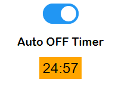

# Arduino Web server

## Proposal
I have a webserver on nodemcu ESP8266 having one Switch to control the appliance. I need to show Switch ON/OFF timing and total Runtime on webserver.

[ESP8266-WebServer](https://github.com/esp8266/Arduino/tree/master/libraries/ESP8266WebServer)
[ESP8266-time](https://www.weigu.lu/microcontroller/tips_tricks/esp_NTP_tips_tricks/index.html)